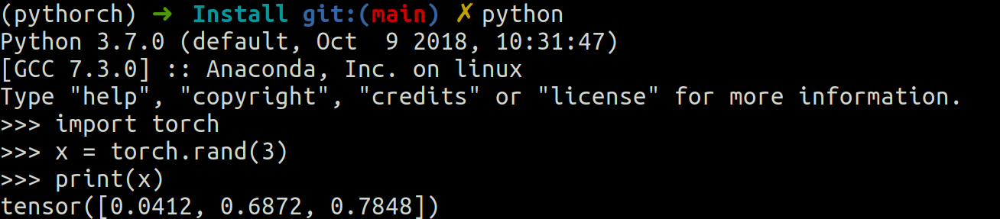

# 1-Instalación

En linux hay que instalado cuda. 

Hay que tener cuidado con la versión de cuda, en nuestro caso tenemos que instalar la versión 11.0 cuda.

* Instalar cuda
    -  Ir a https://developer.nvidia.com/cuda-11.0-download-archive?target_os=Linux&target_arch=x86_64&target_distro=Ubuntu&target_version=2004&target_type=debnetwork

    ~~~
    https://developer.nvidia.com/cuda-11.0-download-archive?target_os=Linux&target_arch=x86_64&target_distro=Ubuntu&target_version=2004&target_type=debnetwork
    ~~~
* Crear  y activarlo entorno para pythorch
~~~
conda create --name pythorch python=3.7
conda activate pythorch
~~~
y después de activarlo ya se puede instalar PyTorch

* Instalar pythorch
    - Ir a https://pytorch.org/get-started/locally/
~~~
conda install pytorch torchvision torchaudio cudatoolkit=11.0 -c pytorch
~~~

* Comprobamos que todo esta correcto
~~~
python
>>> import torch
>>> x = torch.(x)
>>>print(x)
~~~
